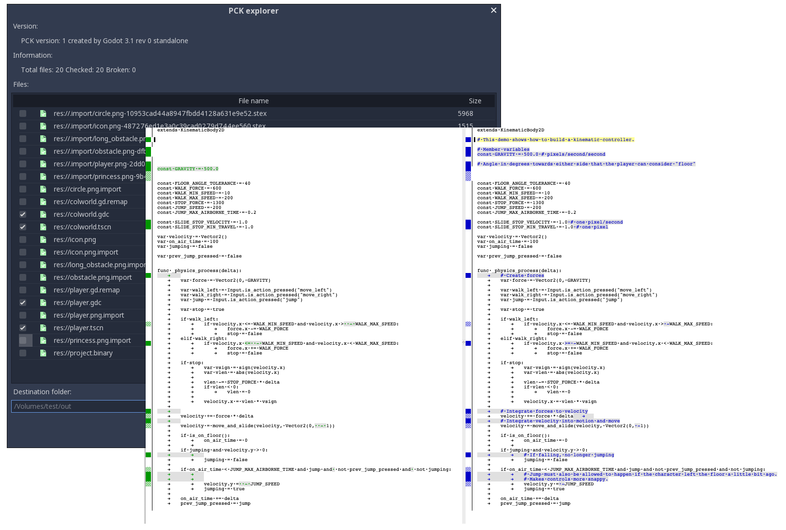

## Godot RE Tools

This software in a pre-alpha stage and is not suitable for use in production.

### Introduction

This module includes following tools:

- PCK archive explorer/tester/extractor/creator.
- GDScript batch "compiler"/"decompiler".
- Resource text <-> binary batch converter.

### Requirements

Godot 3.1

### GDScript decompiler compatibility

#### Supported versions

- Bytecode version: 13, Godot 3.1.0 (beta 2)
- Bytecode version: 12, Godot 3.0.0 - 3.0.6
- Bytecode version: 10, Godot 2.1.3 - 2.1.5
- Bytecode version: 10, Godot 2.1.2 - 2.1.5
- Bytecode version: 10, Godot 2.1.0 - 2.1.1
- Bytecode version: 10, Godot 2.0.0 - 2.0.4-1
- Bytecode version: 4, Godot 1.1.0
- Bytecode version: 3, Godot 1.0.0

Only versions for official Godot releases are included. To decompile scripts from development version of Godot engine look for changes of `_names[]` array in `modules/gdscript/gdscript_functions.cpp` and `GDScriptTokenizer::Token` enum in `modules/gdscript/gdscript_tokenizer.h` and modify `func_names[]` array and `Token` enum in `modules/gdsdecomp/bytecode/bytecode_xxxx.cpp` to match these changes.

### Downloading and compiling

Clone this repository into Godots `modules` subfolder as `gdsdecomp`.
Rebuild Godot engine as described in https://docs.godotengine.org/en/latest/development/compiling/index.html.
