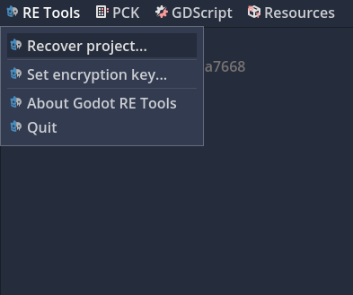
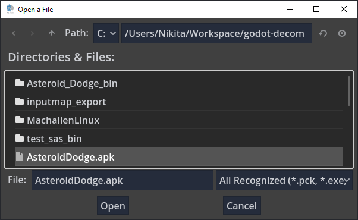
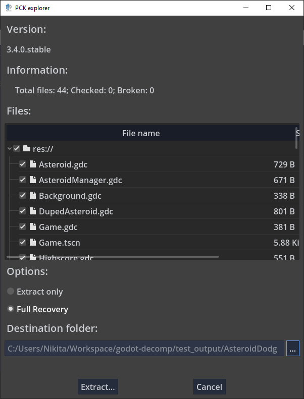
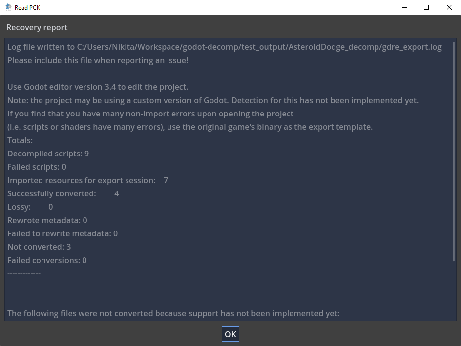

# Godot RE Tools

*This software in an alpha stage. Please report any bugs on the github page.*

## Introduction


This module includes following tools:

- Full project recovery
- PCK archive extractor / creator.
- GDScript batch decompiler.
- Resource text <-> binary batch converter.

Full project recovery performs the following:
- Loads project resources from an APK, PCK, or embedded EXE file
- Decompiles all GDScript scripts
- Recovers the original project file
- Converts all imported resources back to their original import formats
- Converts any auto-converted binary resources back to their original text formats
- Recreates any plugin configuration files

This module has support for decompiling Godot 4.x, 3.x, and 2.x projects.

Grab the latest release version from here: https://github.com/bruvzg/gdsdecomp/releases
## Limitations

Support has yet to be implemented for converting the following resources:
- ADPCM wavs
- Fonts
- Translation files
- Models (`obj`, `dae`, `fbx`, `glb`, etc.)

In addition, it does not support decompiling any GDNative or GDMono scripts. For Mono/CSharp, you can use [Ilspy](https://github.com/icsharpcode/ILSpy) or dotPeek.

## Usage

### GUI

- To perform full project recovery from the GUI, select "Recover project..." from the "RE Tools" menu:

- If the project is encrypted, select the "Set encryption key..." menu option first first and enter the key.
- In the file dialog, select the apk, pck, or embedded exe you want to recover:


- In the PCK explorer dialog, select "Full Recovery" or "Extract Only", then select the directory you want to recover the project to, then click "Extract...":


- After it finishes, it will pop up a recovery box telling you the location of the log file, what editor version you should use when editing the recovered project, report any non-recovered assets:



### Command Line
#### Example:

```bash
gdre_tools --headless --recover=game.pck
```
#### Main arguments:
- `--recover=<pck/exe/apk>` : Perform full project recovery on the specified PCK/EXE/APK.
- `--extract=<pck/exe/apk>` : Perform extraction only (no resource conversion) on the specified PCK/EXE/APK

#### Optional arguments:
- `--output-dir=<out_dir>` : Output directory, defaults to `<NAME>_extracted`, or the project directory if one is specified
- `--key=<key>` : The Key to use if PAK/EXE/APK is encrypted (64 character hex string)
- `--ignore-checksum-errors` : Ignore MD5 errors during PCK checking and perform recovery/extraction anyway

Use the same Godot tools version that the original game was compiled in to edit the project; the recovery log will state what version was detected.

## Compiling from source

Clone this repository into Godot's `modules` subfolder as `gdsdecomp`.
Rebuild Godot engine as described in https://docs.godotengine.org/en/latest/development/compiling/index.html.

For ease of bootstrapping development, we have included launch, build, and settings templates for vscode in the .vscode directory. Once you have read the instructions for compiling Godot above and set up your build environment: put these in the .vscode folder in the Godot directory (not gdsdecomp), remove the ".template" from each, and launch vscode from the Godot directory.

### Requirements

Godot 4.0 (master branch) @ commit https://github.com/godotengine/godot/commit/a7d0e18a317085068c43be29bca1d280d03423a2
- Support for building on 3.x has been dropped and no new features are being pushed
	- Godot RE Tools still retains the ability to decompile 3.x and 2.x projects, however.

### Standalone

Assuming you compiled with `scons platform=linuxbsd target=template_debug`,

```bash
$ bin/godot.linuxbsd.template_debug.x86_64.llvm --headless --path=modules/gdsdecomp/standalone --recover=<pck/apk/exe>
```

## License

The source code of the module is licensed under MIT license.
